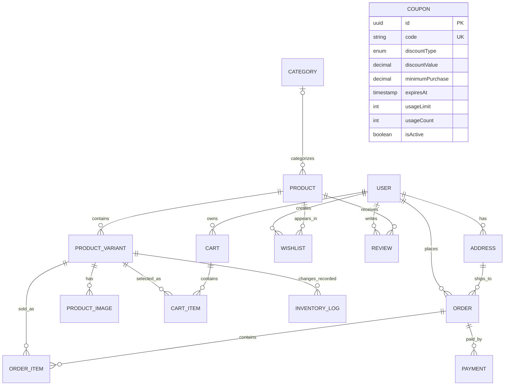

# Yehagere Database Schema

This document describes the database model represented by the TypeORM entities in `src/modules/**/entities` and the current PostgreSQL migration in `src/database/migrations/1784567312716-AutoMigration.ts`.

## Scope and Conventions

- Every entity extends `BaseModel`.
- `BaseModel` provides a UUID primary key named `id`, plus `createdAt`, `updatedAt`, and nullable `deletedAt` timestamps.
- `deletedAt` is a soft-delete column. Relations still define the database foreign-key delete behavior described below.
- Table names are controlled by TypeORM naming configuration. The names in this document use the entity names as logical table names.
- Relation properties such as `user`, `order`, and `productVariant` are owning sides. TypeORM creates the corresponding foreign-key columns on those tables.

## Entity Relationship Diagram

`o|` means zero or one, `||` means exactly one, and `o{` means zero or many.

## Tables

### `user`

| Column | Type | Constraints / Meaning |
|---|---|---|
| `id` | UUID | Primary key |
| `firstName` | string | Required |
| `lastName` | string | Required |
| `email` | string | Required, unique |
| `password` | string | Required, excluded from default selects |
| `phone` | string | Required, unique |
| `role` | enum | `CUSTOMER` or `ADMIN`; defaults to `CUSTOMER` |
| `profileImage` | string | Nullable |
| `isVerified` | boolean | Defaults to `false` |
| `createdAt`, `updatedAt` | timestamp | Managed by TypeORM |
| `deletedAt` | timestamp | Nullable soft-delete timestamp |

### `address`

| Column | Type | Constraints / Meaning |
|---|---|---|
| `id` | UUID | Primary key |
| `city`, `subCity`, `country`, `street`, `phone` | string | Required |
| `isDefault` | boolean | Defaults to `false` |
| `label` | string | Nullable |
| `userId` | UUID | Required foreign key to `user.id`; `ON DELETE CASCADE` |

### `category`

| Column | Type | Constraints / Meaning |
|---|---|---|
| `id` | UUID | Primary key |
| `name` | string | Required, unique |
| `description` | text | Nullable |
| `slug` | string | Required, unique and indexed |
| `image` | string | Nullable |

### `product`

| Column | Type | Constraints / Meaning |
|---|---|---|
| `id` | UUID | Primary key |
| `name` | string | Required, unique |
| `description` | text | Nullable |
| `slug` | string | Required, unique and indexed |
| `gender` | enum | `MEN`, `WOMEN`, or `UNISEX`; defaults to `UNISEX` |
| `status` | enum | `DRAFT`, `ACTIVE`, or `ARCHIVED`; defaults to `ACTIVE` |
| `brand` | string | Required |
| `categoryId` | UUID | **Not nullable in the current migration**; foreign key to `category.id`; `ON DELETE NO ACTION`. The entity metadata currently marks this relation nullable. |

### `product_variant`

| Column | Type | Constraints / Meaning |
|---|---|---|
| `id` | UUID | Primary key |
| `sku` | string | Required, unique and indexed |
| `color`, `size` | string | Required |
| `price` | decimal(10,2) | Required |
| `stock` | int | Defaults to `0` |
| `weight` | decimal(8,2) | Nullable |
| `isActive` | boolean | Defaults to `true` |
| `productId` | UUID | Required foreign key to `product.id`; no delete action specified |

### `product_image`

| Column | Type | Constraints / Meaning |
|---|---|---|
| `id` | UUID | Primary key |
| `imageUrl` | string | Required |
| `isPrimary` | boolean | Defaults to `false` |
| `sortOrder` | int | Defaults to `0` |
| `productVariantId` | UUID | Required foreign key to `product_variant.id`; `ON DELETE CASCADE` |

### `cart`

| Column | Type | Constraints / Meaning |
|---|---|---|
| `id` | UUID | Primary key |
| `userId` | UUID | Required foreign key to `user.id`; `ON DELETE CASCADE` |
| `status` | enum | `ACTIVE`, `COMPLETED`, or `ABANDONED`; defaults to `ACTIVE` |
| `total` | decimal(10,2) | Defaults to `0` |

### `cart_item`

| Column | Type | Constraints / Meaning |
|---|---|---|
| `id` | UUID | Primary key |
| `cartId` | UUID | Required foreign key to `cart.id`; `ON DELETE CASCADE` |
| `productVariantId` | UUID | Required foreign key to `product_variant.id`; `ON DELETE RESTRICT` |
| `quantity` | int | Defaults to `1` |

There is a composite unique constraint on (`cartId`, `productVariantId`), preventing the same variant from appearing twice in one cart.

### `order`

| Column | Type | Constraints / Meaning |
|---|---|---|
| `id` | UUID | Primary key |
| `orderNumber` | string | Required, unique |
| `subtotal`, `shippingFee`, `tax`, `discount`, `total` | decimal(10,2) | Required monetary values |
| `paymentStatus` | enum | `PENDING`, `PAID`, `FAILED`, or `REFUNDED`; defaults to `PENDING` |
| `orderStatus` | enum | `PENDING`, `PROCESSING`, `SHIPPED`, `DELIVERED`, or `CANCELLED`; defaults to `PENDING` |
| `userId` | UUID | Required foreign key to `user.id`; `ON DELETE RESTRICT` |
| `addressId` | UUID | Required foreign key to `address.id`; `ON DELETE RESTRICT` |

### `order_item`

| Column | Type | Constraints / Meaning |
|---|---|---|
| `id` | UUID | Primary key |
| `price` | decimal(10,2) | Required price captured for the order line |
| `quantity` | int | Required |
| `subtotal` | decimal(10,2) | Required line subtotal |
| `orderId` | UUID | Required foreign key to `order.id`; `ON DELETE CASCADE` |
| `productVariantId` | UUID | Required foreign key to `product_variant.id`; `ON DELETE RESTRICT` |

### `payment`

| Column | Type | Constraints / Meaning |
|---|---|---|
| `id` | UUID | Primary key |
| `provider` | enum | `CHAPA`, `TELEBIRR`, or `CASH_ON_DELIVERY` |
| `transactionId` | string | Nullable, unique when provided |
| `amount` | decimal(10,2) | Required |
| `status` | enum | `PENDING`, `SUCCESS`, `FAILED`, or `REFUNDED`; defaults to `PENDING` |
| `paidAt` | timestamp | Nullable |
| `orderId` | UUID | Required foreign key to `order.id`; `ON DELETE CASCADE` |

### `review`

| Column | Type | Constraints / Meaning |
|---|---|---|
| `id` | UUID | Primary key |
| `rating` | int | Required |
| `comment` | text | Required |
| `userId` | UUID | Required foreign key to `user.id`; `ON DELETE CASCADE` |
| `productId` | UUID | Required foreign key to `product.id`; `ON DELETE CASCADE` |

There is a composite unique constraint on (`userId`, `productId`), allowing one review per user for each product.

### `wishlist`

| Column | Type | Constraints / Meaning |
|---|---|---|
| `id` | UUID | Primary key |
| `userId` | UUID | Required foreign key to `user.id`; `ON DELETE CASCADE` |
| `productId` | UUID | Required foreign key to `product.id`; `ON DELETE CASCADE` |

There is a composite unique constraint on (`userId`, `productId`), preventing duplicate wishlist entries.

### `inventory_log`

| Column | Type | Constraints / Meaning |
|---|---|---|
| `id` | UUID | Primary key |
| `change` | int | Required stock change amount in the current migration |
| `reason` | enum | `RESTOCK`, `ORDER`, `RETURN`, or `MANUAL_ADJUSTMENT` |
| `productVariantId` | UUID | Required foreign key to `product_variant.id`; `ON DELETE CASCADE` |

### `coupon`

| Column | Type | Constraints / Meaning |
|---|---|---|
| `id` | UUID | Primary key |
| `code` | string | Required, unique and indexed |
| `discountType` | enum | `PERCENTAGE` or `FIXED` |
| `discountValue` | decimal(10,2) | Required |
| `minimumPurchase` | decimal(10,2) | Required |
| `expiresAt` | timestamp | Required |
| `usageLimit` | int | Required |
| `usageCount` | int | Defaults to `0` |
| `isActive` | boolean | Defaults to `true` |

## Relationship Details

| Relationship | Cardinality | Owning foreign key | Delete behavior |
|---|---:|---|---|
| User -> Cart | 1 to many | `cart.userId` | Deleting a user cascades to carts |
| User -> Order | 1 to many | `order.userId` | User deletion restricted while orders exist |
| User -> Address | 1 to many | `address.userId` | Deleting a user cascades to addresses |
| User -> Wishlist | 1 to many | `wishlist.userId` | Deleting a user cascades to wishlist entries |
| User -> Review | 1 to many | `review.userId` | Deleting a user cascades to reviews |
| Category -> Product | 1 to many; current migration requires a category | `product.categoryId` | `ON DELETE NO ACTION`; entity metadata currently marks the relation nullable |
| Product -> ProductVariant | 1 to many | `productVariant.productId` | No explicit delete action |
| Product -> Wishlist | 1 to many | `wishlist.productId` | Deleting a product cascades to wishlist entries |
| Product -> Review | 1 to many | `review.productId` | Deleting a product cascades to reviews |
| ProductVariant -> ProductImage | 1 to many | `productImage.productVariantId` | Deleting a variant cascades to images |
| ProductVariant -> CartItem | 1 to many | `cartItem.productVariantId` | Variant deletion restricted while in carts |
| ProductVariant -> OrderItem | 1 to many | `orderItem.productVariantId` | Variant deletion restricted while in orders |
| ProductVariant -> InventoryLog | 1 to many | `inventoryLog.productVariantId` | Deleting a variant cascades to logs |
| Cart -> CartItem | 1 to many | `cartItem.cartId` | Deleting a cart cascades to items |
| Order -> OrderItem | 1 to many | `orderItem.orderId` | Deleting an order cascades to items |
| Order -> Payment | 1 to many | `payment.orderId` | Deleting an order cascades to payments |
| Address -> Order | 1 to many | `order.addressId` | Address deletion restricted while orders exist |

## Current Schema Gaps and Notes

1. `Coupon` is standalone. No `Order`, `User`, or coupon-redemption entity references it, so coupon application and usage tracking are not enforced through a database relationship.
2. `OrderItem` stores the selected variant and price, but it does not store a direct `productId`. Product information is reached through `ProductVariant`.
3. `ProductVariant.product` and `Product.category` do not specify `onDelete`. The current migration creates `ON DELETE NO ACTION` for both foreign keys; it should be made explicit in the entities if deletion semantics are important.
4. The entity relations do not specify `eager`, so related records are not automatically loaded unless services request relations explicitly.
5. The entity metadata does not define explicit indexes for foreign-key columns. The database may create or omit those indexes depending on the generated migration and database engine.
6. The current migration and entity metadata disagree for inventory logs: the migration has one `change` column, while the entity declares `previousStock` and `newStock`. Regenerate or correct the migration before deploying changes that use the entity definition.
